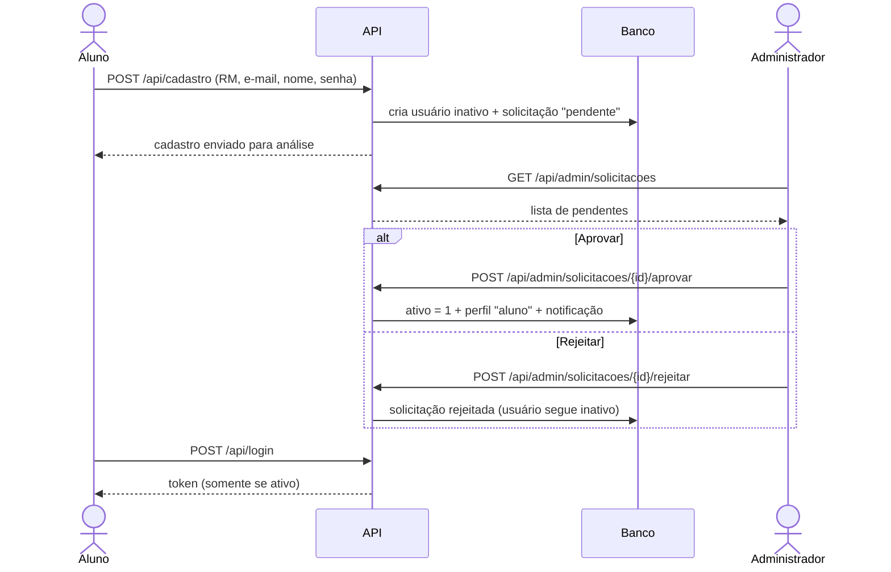
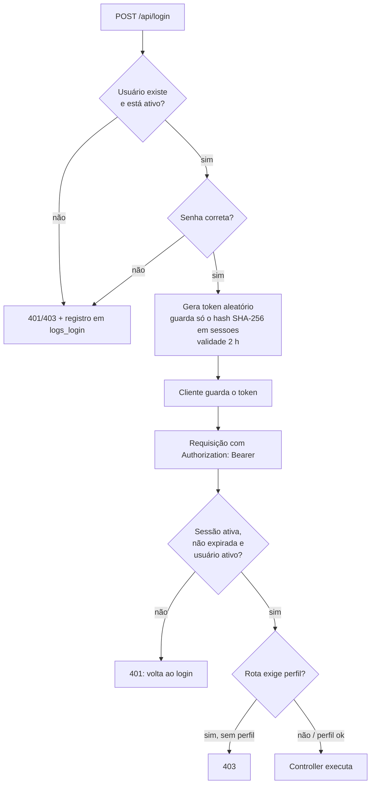
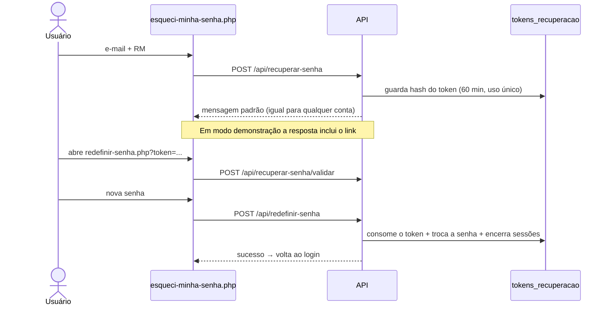

# Fluxogramas

Diagramas em [Mermaid](https://mermaid.js.org/) (o GitHub os renderiza automaticamente).

## Cadastro e aprovação

```mermaid
sequenceDiagram
    actor A as Aluno
    participant API as API
    participant DB as Banco
    actor ADM as Administrador

    A->>API: POST /api/cadastro (RM, e-mail, nome, senha)
    API->>DB: cria usuário inativo + solicitação "pendente"
    API-->>A: cadastro enviado para análise
    ADM->>API: GET /api/admin/solicitacoes
    API-->>ADM: lista de pendentes
    alt Aprovar
        ADM->>API: POST /api/admin/solicitacoes/{id}/aprovar
        API->>DB: ativo = 1 + perfil "aluno" + notificação
    else Rejeitar
        ADM->>API: POST /api/admin/solicitacoes/{id}/rejeitar
        API->>DB: solicitação rejeitada (usuário segue inativo)
    end
    A->>API: POST /api/login
    API-->>A: token (somente se ativo)
```

## Login e requisições autenticadas

```mermaid
flowchart TD
    L[POST /api/login] --> V{Usuário existe<br/>e está ativo?}
    V -- não --> E1[401/403 + registro em logs_login]
    V -- sim --> P{Senha correta?}
    P -- não --> E1
    P -- sim --> T[Gera token aleatório<br/>guarda só o hash SHA-256 em sessoes<br/>validade 2 h]
    T --> C[Cliente guarda o token]
    C --> R[Requisição com Authorization: Bearer]
    R --> M{Sessão ativa,<br/>não expirada e<br/>usuário ativo?}
    M -- não --> E2[401: volta ao login]
    M -- sim --> F{Rota exige perfil?}
    F -- sim, sem perfil --> E3[403]
    F -- não / perfil ok --> OK[Controller executa]
```

## Recuperação de senha

```mermaid
sequenceDiagram
    actor U as Usuário
    participant FE as esqueci-minha-senha.php
    participant API as API
    participant DB as tokens_recuperacao

    U->>FE: e-mail + RM
    FE->>API: POST /api/recuperar-senha
    API->>DB: guarda hash do token (60 min, uso único)
    API-->>FE: mensagem padrão (igual para qualquer conta)
    Note over FE,API: Em modo demonstração a resposta inclui o link
    U->>FE: abre redefinir-senha.php?token=...
    FE->>API: POST /api/recuperar-senha/validar
    U->>FE: nova senha
    FE->>API: POST /api/redefinir-senha
    API->>DB: consome o token + troca a senha + encerra sessões
    API-->>FE: sucesso → volta ao login
```
